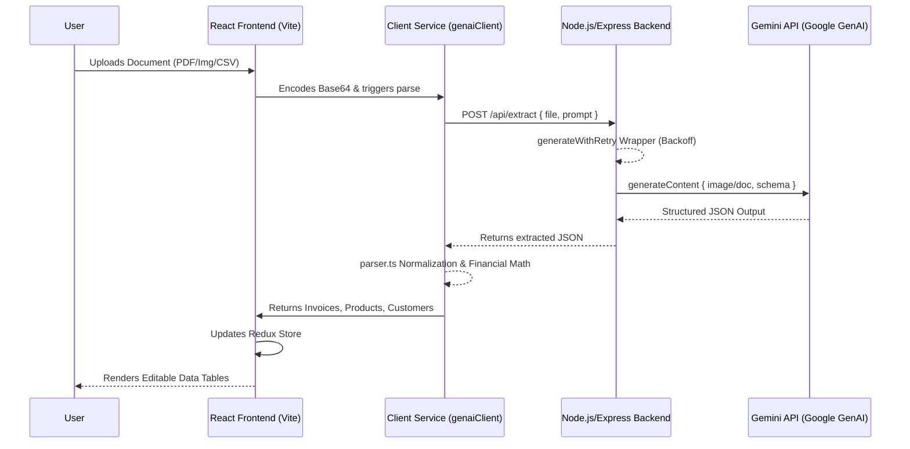

# AI Invoice & Spreadsheet Extraction App

A production-ready full-stack application designed to parse, normalize, and validate complex financial documents (invoices, receipts, and summary spreadsheets) using Google's generative AI models.

## 🏗 Architecture Diagram



## ✨ Key Features

- **Multi-modal Extraction**: Upload PDFs, images, or summary spreadsheets. The system extracts relational entities (Invoices, Customers, Products).
- **Strict Schema Enforcement**: Utilizes Gemini's Native Structured Outputs to guarantee deterministic API results without brittle regex scraping.
- **Summary Data Fallback**: Automatically handles summary-level accounting spreadsheets (missing individual line-items) by mathematically reverse-engineering records into a universal "General Entry" product ledger to maintain accurate net and tax totals.
- **Dynamic Tax Rate Engineering**: Reverse-engineers missing tax percentage rates using raw `$ Amount` data coupled with safe floating-point arithmetic logic.
- **Export Ready**: Download the normalized tables (Invoices, Products, Customers) out to clean CSV formats with empty/null field protection.
- **Resilient AI Calling**: Wraps the AI execution logic in an Exponential Backoff strategy to gracefully mitigate `503 High Demand` errors or rate limits.

## 🛠 Technology Stack

| Component | Technology | Purpose |
| :--- | :--- | :--- |
| **Frontend Renderer** | React 18 | Declarative UI and component lifecycle management. |
| **State Management** | Redux Toolkit (RTK) | Predictable, centralized state for data tables and async actions. |
| **Styling** | Tailwind CSS | Utility-first CSS framework for responsive layout execution. |
| **Backend Server** | Node.js & Express | API Gateway proxying requests securely without exposing secrets. |
| **AI SDK** | `@google/genai` | Modern TypeScript SDK to interact with Gemini 2.5 Pro/Flash. |
| **Build Tool** | Vite | Lightning-fast module bundler and HMR. |

## 🔄 End-to-End System Flow

1. **Document Ingestion**: The user uploads a financial document (PDF, Receipt Image, or Spreadsheet) through the drag-and-drop React interface.
2. **Preprocessing**: The file is converted to a base64 encoded string format on the client-side alongside its respective MIME type (`application/pdf`, `image/png`, etc.).
3. **Secure API Transport**: The frontend transmits the payload to our intermediate Node.js Express backend via the `/api/extract` REST endpoint. This ensures the `GEMINI_API_KEY` remains securely hidden from the browser.
4. **Resilient AI Extraction**: The backend proxy routes the request to the `gemini-2.5-pro` (or flash) model using the `@google/genai` SDK. It forces a rigid `responseSchema` to guarantee structured JSON. The call is wrapped in an Exponential Backoff circuit to automatically wait and retry if hitting `503 High Demand` limits.
5. **Data Normalization Engine**: Once the raw JSON returns from Gemini, the client-side `parser.ts` engine kicks in. It dynamically maps relational ID keys, reconstructs missing `taxPercentages`, dedupes floating-point arithmetic properly (handling standard JS float math anomalies), and provides fallback entities for unstructured summary tables.
6. **Data Presentation & Export**: The normalized arrays (Invoices, Products, Customers) are pushed into the Redux store and beautifully rendered within interactive data tables. Users can verify, edit, and then reliably export these normalized databases to CSV.

## 🔌 Core API Interfaces

### Internal Proxy Endpoint

**`POST /api/extract`**
Proxies the file payload to Google Gen AI securely.

**Request Body Payload**
| Field | Type | Description |
| :--- | :--- | :--- |
| `mimeType` | `string` | The MIME type of the uploaded file (e.g. `image/png`, `application/pdf`). |
| `data` | `string` | The raw Base64 encoded payload of the document. |
| `customPrompt` | `string` (Optional) | Any specific extraction rules defined by the user. |

**Response Payload (Standardized JSON via Gemini)**
| Field | Type | Description |
| :--- | :--- | :--- |
| `extract_successful`| `boolean` | Flag indicating if standard invoice elements were detected. |
| `summary` | `object` | Global metrics, vendor name, bounding dates, and `currency_code`. |
| `customers` | `array` | A list of distinct Customer entities with AI-generated Foreign Keys (`customer_id`). |
| `products` | `array` | A list of distinct Product entities with AI-generated Foreign Keys (`product_id`). |
| `invoices` | `array` | The line-item ledger mapping Quantities and Taxes to their relational Product/Customer IDs. |

## 🗂 Project Structure

- `/src/components/` - React UI, Tables, and layout components.
- `/src/services/` - Gemini API extraction client and semantic JSON parsing logic (`parser.ts`).
- `/server.ts` - Node.js Express backend implementing proxy routes and the centralized `generateWithRetry` flow.
- `/src/utils/` - Helpers for File conversions, Base64 encodings, and CSV exports.

## 🚀 Getting Started

### Prerequisites

You need a valid Gemini API key. Ensure it is placed within your `.env` configuration:
```env
GEMINI_API_KEY=your_api_key_here
```

### Installation

1. Install dependencies:
   ```bash
   npm install
   ```

2. Run the application (starts both the Express backend and Vite frontend via concurrent processes or middleware):
   ```bash
   npm run dev
   ```

3. Open the app in your browser (typically `http://localhost:3000`).

## 📚 Technical Documentation

For an in-depth dive into the internal data normalization logic, schema design, and financial math preservation strategies, please read our [Technical Architecture Strategy](./TECHNICAL_ARCHITECTURE.md).

## 📄 License
MIT
